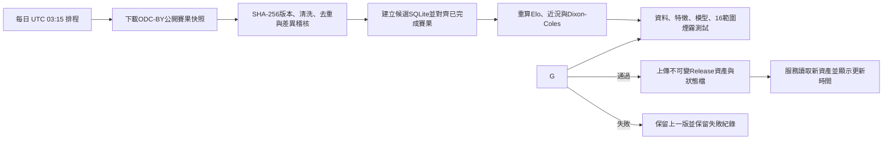

# Aurelia Football 每日資料更新：部署與稽核手冊

## 現況與啟用邊界

Web 應用會顯示 SQLite 匯入資料中的 **Last Updated Timestamp**，並在單一暖執行個體內快取 SQLite 與校準模型檔。每日流程定義於 `.github/workflows/daily-data-refresh.yml`，會在 **UTC 03:15** 執行，也可由 `workflow_dispatch` 人工觸發。

結果來源為 `schochastics/football-data` 公開的 `games.parquet` 快照，授權為 **ODC-BY**。流程每次下載新的快照、記錄SHA-256、檢查其已完成賽果，並輸出 `result_sync_report.json`。這不是即時投注或HKJC資料介面；它只用於已完成賽事的可重現模型資料更新。

> 資料更新必須同時更新 SQLite、賽前特徵、模型與績效資產；只更新比分而不重算 Elo／Dixon–Coles／模型會造成資料與推論狀態不一致。

## 每日流程

每日排程不會直接修改正在服務中的SQLite。它先在隔離執行環境生成完整候選版本，只有所有品質關卡通過後才以不可變版本化資產和最新指標原子切換。



| 階段 | 必須產物 | 失敗處理 |
|---|---|---|
| 擷取與清洗 | 來源網址、快照SHA-256、擷取UTC、去重統計、`result_sync_report.json`、候選 `matches` | 不覆蓋既有production資產 |
| 結果對齊 | 同比分確認、未匹配／歧義／衝突稽核列 | 衝突比數不靜默覆寫；阻擋發布或保留既有結果 |
| 特徵 | `training_features_expanded.csv` 與特徵驗證結果 | 阻擋後續訓練 |
| 模型 | `.pkl`、折外指標、校準與混淆矩陣資料 | 若資料洩漏或品質門檻失敗則中止發布 |
| 發布 | 版本化SQLite、模型、績效JSON、`pipeline_status.json` | 只在全部檔案上傳後切換版本指標 |
| 服務驗證 | 16個已驗證資料範圍的隊伍清單與端到端機率總和測試 | 回退至上一個資產版本 |

## 資料治理

每日同步僅處理既有16個模型資料範圍中的已完成賽事。對齊採同聯賽、日期±1日、主客隊正規化後的精確比對；未匹配或多重匹配的資料只會記錄，不會自動擴張模型範圍。若候選SQLite已有最終比分而公開快照不同，流程將該筆記為衝突並拒絕覆寫。

由於候選資料庫本身已經從同一版本化快照重建，正常情況下同步報告中的 `confirmed` 應為主要類別。報告仍存在，是為了驗證建置輸入、捕捉名稱對齊異常並讓每次模型重訓具有可稽核的資料版本證據。

## GitHub Actions 設置

工作流程以GitHub內建 `GITHUB_TOKEN` 的 `contents: write` 權限建立不可變 `data-<UTC>-<commit>` Release。每日候選版本會先執行結果同步單元測試，之後下載公開快照並建立SHA-256與差異報告；只有資料、結果對齊、特徵、模型、績效與16個資料範圍煙霧測試都通過後，才上傳 `data-latest/pipeline_status.json` 作為最後指標。

```yaml
name: Aurelia daily football data refresh
on:
  schedule:
    - cron: "15 3 * * *"
  workflow_dispatch:

permissions:
  contents: write

jobs:
  build-validate-publish:
    runs-on: ubuntu-latest
    steps:
      - uses: actions/checkout@v4
      - uses: actions/setup-python@v5
        with:
          python-version: "3.11"
      - run: python -m pip install --upgrade pip && pip install -r requirements.txt
      - run: python -m unittest data-pipeline/test_daily_update.py
      - run: python data-pipeline/run_daily_refresh.py --output-dir build/daily
      - env:
          GH_TOKEN: ${{ github.token }}
        run: bash scripts/publish_github_release.sh build/daily
```

`scripts/publish_github_release.sh` 只接受已通過驗證的輸入，產生不可變版本名稱與UTC `generated_at`，並在資料庫、模型及績效資產上傳成功後才更新production指標。`pipeline_status.json` 是唯一可變的最新版本指標；未完成候選版本不會被服務端採用。網站最多每15分鐘檢查一次指標，驗證失敗則繼續使用先前Release；若尚無成功Release，會安全回退至既有受管模型資產。

## Heartbeat與應用程式責任分離

網站端適合做狀態讀取、健康檢查與通知。下載大型資料快照、建立SQLite、重訓XGBoost與發布資產等重型工作，必須在隔離CI執行器中完成；不應放進production請求或短時限排程處理器。

## 啟用驗收

在對使用者宣稱「每日更新已啟用」前，必須確認公開快照可下載且已記錄SHA-256、同步測試與差異稽核通過、GitHub儲存庫已連接、工作流程具 `contents: write`、候選資產上傳成功、16個資料範圍煙霧測試通過，以及首頁的Last Updated Timestamp已反映新版本。
