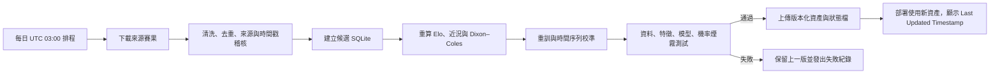

# Aurelia Football 每日資料更新：部署與稽核手冊

## 現況與啟用邊界

目前 Web 應用會顯示 SQLite 匯入資料中的 `Last Updated Timestamp`，並在單一暖執行個體內快取 SQLite 與校準模型檔。**每日更新尚未啟用**：本專案目前使用受管程式碼遠端，而非已連接的 GitHub 儲存庫；GitHub 連接亦尚未啟用。這份手冊定義可部署的每日更新流程，避免把尚未執行的排程誤寫成已完成。

> 資料更新必須同時更新 SQLite、賽前特徵、模型與績效資產；只更新比分而不重算 Elo／Dixon–Coles／模型會造成資料與推論狀態不一致。

## 建議的每日流程

每日 UTC 03:00 由已連接 GitHub 儲存庫的工作流程觸發。排程不應直接修改正在服務中的 SQLite；應先在隔離執行環境生成完整候選版本，再以版本化資產進行原子切換。



| 階段 | 必須產物 | 失敗處理 |
|---|---|---|
| 擷取與清洗 | 來源網址、擷取 UTC、去重統計、候選 `matches` | 不覆蓋既有 production 資產 |
| 特徵 | `training_features_expanded.csv` 與特徵驗證結果 | 阻擋後續訓練 |
| 模型 | `.pkl`、折外指標、校準／混淆矩陣資料 | 若資料洩漏檢查或品質門檻失敗則中止發布 |
| 發布 | 版本化 SQLite、模型、績效 JSON、`pipeline_status.json` | 只在全部檔案已上傳後切換版本指標 |
| 服務驗證 | 13 聯賽隊伍清單與端到端機率總和測試 | 回復上一個資產版本 |

## GitHub Actions 設置

啟用前，先將 Web 專案匯出或同步至你本人擁有的 GitHub 儲存庫，並為工作流程提供**伺服器端**的資產發布憑證。不可將任何憑證寫入前端或提交至 Git。

| 設定 | 用途 |
|---|---|
| `DATA_ASSET_UPLOAD_URL` | 將版本化 SQLite、模型及績效 JSON 上傳至私有資產儲存的端點 |
| `DATA_ASSET_UPLOAD_TOKEN` | 上述端點的伺服器端驗證憑證 |
| `DEPLOY_WEBHOOK_URL`（可選） | 資產通過驗證後觸發重新部署或快取失效 |
| `DATA_SOURCE_*`（如需要） | 僅在供應商要求驗證時設定；公開來源不應濫用私鑰 |

工作流程的 cron 使用六欄或五欄格式視執行平台而定；GitHub Actions 使用標準五欄 UTC 表示式，例如 `0 3 * * *`。每次執行都應可人工以 `workflow_dispatch` 觸發，以便先驗證資料品質與資產發布權限。

```yaml
name: Aurelia daily football data refresh
on:
  schedule:
    - cron: "0 3 * * *"
  workflow_dispatch:

jobs:
  refresh:
    runs-on: ubuntu-latest
    permissions:
      contents: read
    steps:
      - uses: actions/checkout@v4
      - uses: actions/setup-python@v5
        with:
          python-version: "3.11"
      - name: Install reproducible Python dependencies
        run: pip install -r requirements.txt
      - name: Build and validate candidate assets
        run: |
          python football_database/build_football_db.py --database build/football_data.db
          python football_database/build_expanded_leagues_db.py --base-database build/football_data.db --open-results build/open_football_games.parquet --output build/football_data_expanded.db
          python football_database/build_match_features.py --database build/football_data_expanded.db --output build/training_features_expanded.csv
          python football_database/train_soccer_predict_model.py --input build/training_features_expanded.csv --output-dir build/model_artifacts
          python football_database/validate_expanded_leagues.py
      - name: Publish only validated versioned assets
        env:
          DATA_ASSET_UPLOAD_URL: ${{ secrets.DATA_ASSET_UPLOAD_URL }}
          DATA_ASSET_UPLOAD_TOKEN: ${{ secrets.DATA_ASSET_UPLOAD_TOKEN }}
        run: ./scripts/publish_validated_assets.sh build
```

此範例刻意將實際發布封裝為 `publish_validated_assets.sh`：該腳本必須只接受已通過驗證的輸入、產生不可變版本名稱、寫入 UTC `last_updated_at` 與版本摘要，並在全部資產上傳成功後才更新 production 指標。請依最終選擇的資產儲存服務實作此腳本。

## Heartbeat 與應用程式責任分離

網站內的每日觸發可透過受管 HTTP 排程呼叫 `/api/scheduled/*`，但 2 分鐘處理上限不適合在 production 請求內下載多源資料、重訓 XGBoost 並發布大型 SQLite／`.pkl`。因此，網站端適合做**狀態讀取、健康檢查與通知**；重型 ETL／訓練應在隔離的 CI 執行器完成。若日後使用受管 HTTP 排程，處理器必須驗證 cron 身分、具冪等性、以 2xx 回傳已處理或孤立任務，並透過版本化資產避免重試覆寫新版本。

## 所有權與驗收

啟用前必須完成下列檢查：資料來源可用、GitHub 儲存庫已連接、必要 secrets 已加入、候選資產上傳成功、13 聯賽煙霧測試通過，且首頁的 `Last Updated Timestamp` 已反映新版本。只有這些條件皆成立時，才可對使用者宣稱「每日更新已啟用」。
